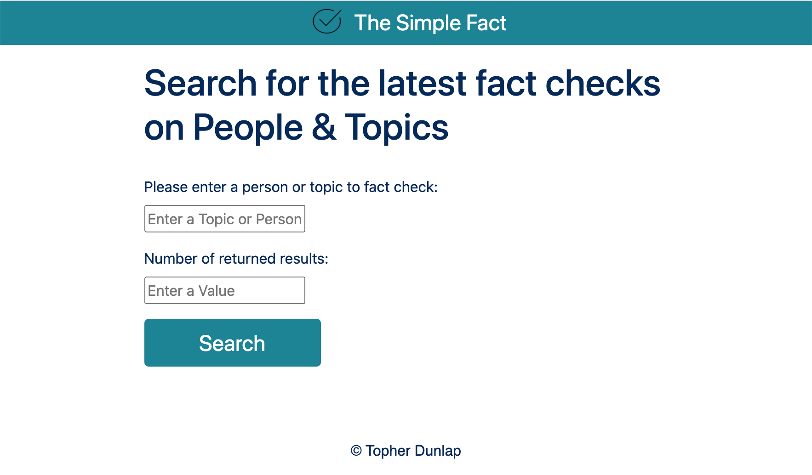
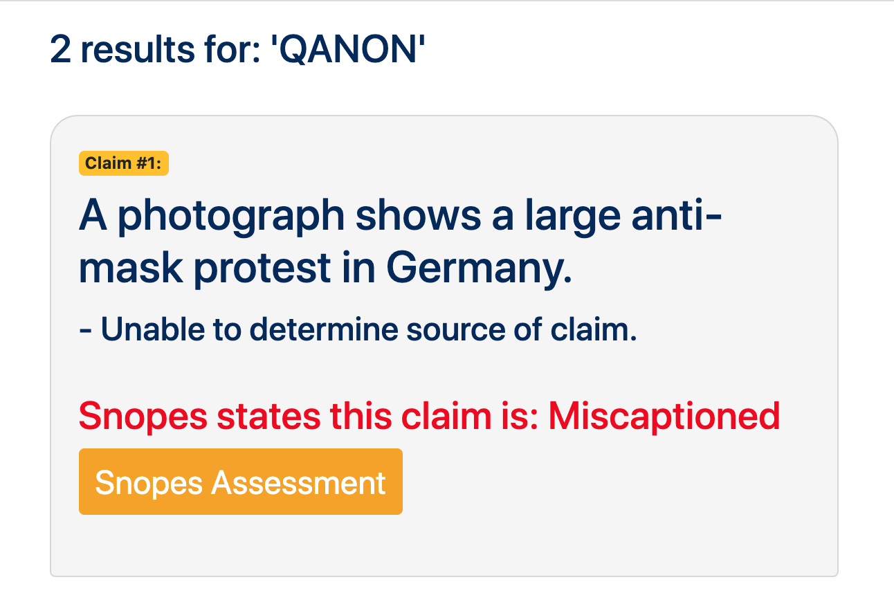

https://topher-dunlap.github.io/fact_check_app/

<!-- # book-thing.io

Initial wireframes:

https://wireframe.cc/x0a8I9

https://wireframe.cc/6oVXTU -->
# fact_check_app

This app agrigates and displays results from the Google Fact Check API in an easy to read manner. It also combines the Media bias and Factual reporting record for the fact checking source.

## Motivation

I wanted to create a resource to help dissipate the volumes of misinformation we see in our society.

## Screenshots
Login Screen/Landing Page:

About:

Results:

## How to Use

1. Enter a person or a topic in the search field.
2. Enter the number of results you'd like back
3. Scroll through the results and interact with the different options for viewing claim check aritcles and bias ratings.

## Built With

### Front-End
* HTML
* CSS
* JavaScrip
* jQuery

## Features

* Searches fact checked claims 
* Shows latest claim checks
* Gives factual reporting record of source doing the fact checking
* Gives media bias rating of source doing the fact checking

## Demo

- [Live Demo](https://book-thing.herokuapp.com/)

## Authors

* **Topher Dunlap** - ** - Design, Front-End development/testing, styling

## Acknowledgments

* **Michael Soileau** - ** - The Great Savior, The Wise Sage
